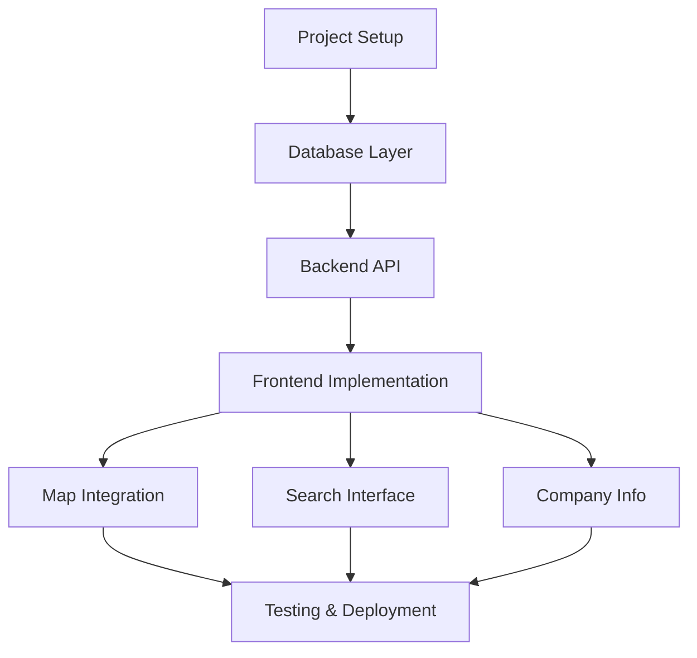
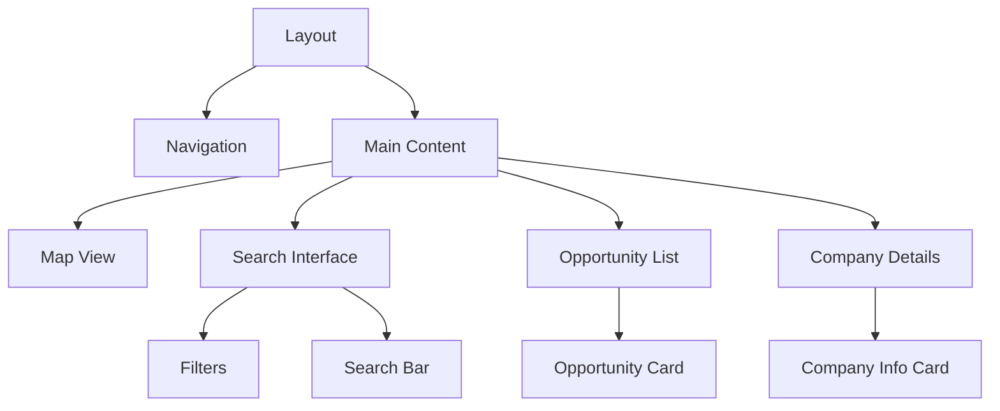
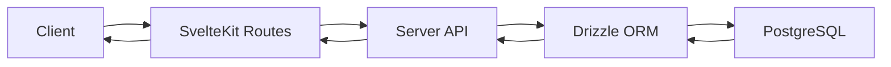

# Skillbridge Opportunities Website Implementation Plan

This document outlines the implementation plan for creating a web application to display and search Skillbridge opportunities using TypeScript, SvelteKit 5, Drizzle ORM, and DaisyUI.

## Project Overview



## 1. Project Setup

- Initialize new SvelteKit project with TypeScript
- Configure Drizzle ORM
- Set up DaisyUI and TailwindCSS
- Configure project structure and routing
- Set up development environment

## 2. Database Layer

- Create Drizzle schema based on existing PostgreSQL structure
- Define type-safe queries
- Set up database connection and pooling
- Implement data access layer

## 3. Backend API (SvelteKit Server Routes)

```mermaid
graph LR
    A[API Routes] --> B[/opportunities]
    A --> C[/search]
    A --> D[/company-info]
    B --> E[GET: List all]
    B --> F[GET: Get by ID]
    C --> G[POST: Search with filters]
    D --> H[GET: Company details]
```

### API Endpoints

- Create API endpoints for:
  - Fetching opportunities (paginated)
  - Search functionality
  - Company information
  - Filtering and sorting

## 4. Frontend Components



### Key Components

- Interactive map using Mapbox or Leaflet
- Search interface with filters
- Opportunity cards with detailed view
- Company information panels
- Navigation and layout components

## 5. Features & Functionality

### Map Integration

- Interactive map showing all opportunities
- Clustering for multiple opportunities in same area
- Pop-up information on hover/click
- Filtering capabilities

### Search Interface

- Full-text search across all fields
- Filter by:
  - Location (State/City)
  - Service branch
  - Job family
  - Duration
  - Delivery method
- Sort by relevance, location, etc.

### Company Information

- Detailed company profiles
- Related opportunities
- Job family information
- Success stories (if available)

## 6. Technical Considerations

### Data Flow



### Performance Optimizations

- Server-side rendering for initial load
- Client-side navigation
- Lazy loading for map and company data
- Caching strategies
- Pagination for large datasets

### State Management

- Use Svelte 5's runes for reactive state
- Implement stores for global state
- Handle loading and error states

## Implementation Questions

Key decisions needed:

1. Map library selection (Mapbox vs Leaflet)
2. Authentication requirements
3. Analytics tracking implementation
4. Company data enrichment sources

## Next Steps

1. Finalize technology decisions
2. Set up development environment
3. Begin implementation of core features
4. Establish testing strategy
5. Plan deployment process
